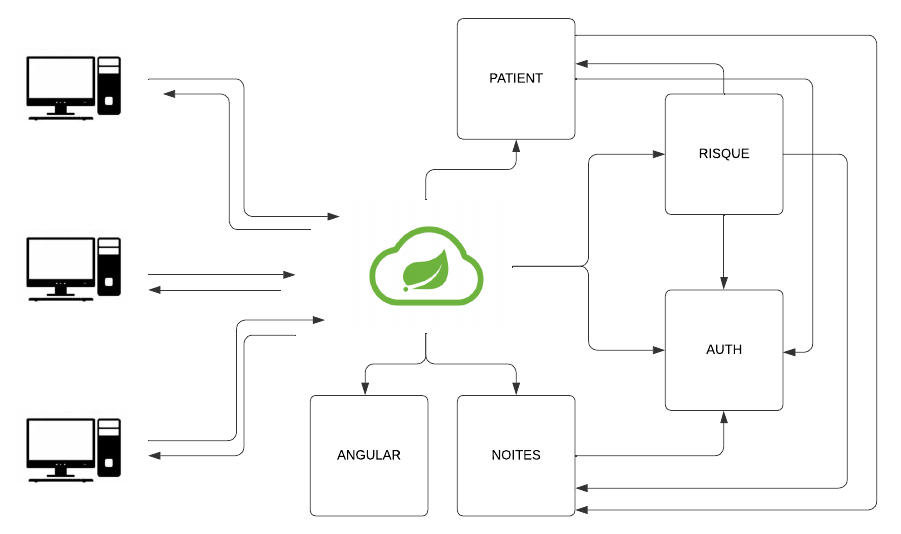

<p style="text-align: center">
  
</p>

<div style="display: flex; justify-content: space-between; margin-bottom: 20px" >
    
    
    
    
    
    
    
    
</div>

---

# Médilabo Solutions

1. Introduction
    1. FrontEnd
    2. Sécurité
2. Mise en place
    1. Environnement de développement
        1. Configuration des bases de données
        2. Installation du projet
        3. Démarage de l'application
        4. Accès au système
    2. Docker
        1. Les fichier .jar
        2. Le dossier dist
        3. Variables d'environnement
        4. Démarage de l'application
        5. Accès au système
3. Architecture
    1. La structure en microservice
    2. Les service
        1. Gateway
        2. Patient
        3. Note
        4. Risque
        5. Auth
        6. Angular
5. Gree Code


## Introduction

Ce projet a été réalisé comme le dernier projet de la formation de développeur Java OpenClassRooms. 
L'objectif était de réaliser un projet structuré en microservices. À l'origine, il était demandé un microservice pour gérer l'enregistrement des patients avec une base de données SQL, un service pour gérer les notes des médecins dans MongoDb et un service pour calculer le niveau de risque du patient, qui n'avait pas besoin de base de données et aucune technologie n'a été imposée pour l'interface.
Tous ces services doivent être gérés par Spring Gateway.

### ForntEnd

Il n’y avait aucune détermination en amont quant à l’utilisation d'une technologie spécifique. Par conséquent, on a choisi Angular. L'architecture d'application monopage s'intègre très bien dans ce projet, en plus de permettre la pratique de concepts importants en développement web, comme JWT, la sécurité des routes, entre autres.

### Sécurité

L'un des prérequis pour ce projet était l'utilisation de la bibliothèque Spring Security, cependant nous n'avons pas trouvé approprié l'utilisation de cette bibliothèque pour deux raisons. Premièrement, son implémentation devrait se faire pour chaque microservice, ce qui pourrait générer des problèmes de cohérence ou des failles de sécurité, et deuxièmement, implémenter la sécurité Spring dans un seul microservice d'authentification n'avait pas beaucoup de sens, puisque la force de cette bibliothèque réside dans l'autorisation et l'authentification. dans un contexte, ce qui ne serait pas le cas, puisque nous travaillons dans une architecture de microservices.

Cependant, comme c'était un des prérequis du projet, il est possible de trouver une Branche avec cette implémentation

## Mise en place

### Environnement de développement

**Prérequis**

* JDK 17
* Maven
* Mysql
* MongoDB
* Redis

#### Configuration des bases de données

 - Mysql

Il existe deux services qui communiquent avec la base de données Mysql, le code fonctionne avec des variables d'environnement, vous pouvez donc nommer l'accès à la base de données, le mot de passe et l'utilisateur du service (Patient et Auth) comme vous le souhaitez.

Il existe deux scripts MySQL dans le dossier db-docker qui peuvent être utilisés pour démarrer ces systèmes.

Les tests d'intégration sont configurés dans un fichier séparé appelé application-test.properties. Si vous souhaitez exécuter les tests, vous devrez le configurer de manière appropriée en fonction des informations d'identification de votre base de données, car il n'utilise pas de variables d'environnement (à la fois dans le service patient et dans le service d'authentification).

 - MongoDB

Le service Note utilise cette base de données et dispose également d'un script dans le dossier db-docker.

Bien qu'il soit possible d'accéder à mongodb sans identifiants d'accès, le code a des variables d'environnement dans ce sens, il faudra donc saisir les identifiants d'accès mongodb dans les variables d'environnement ou modifier le code pour qu'il puisse accéder sans ces variables

 - Redis

Dans le cas de la base de données Redis, utilisée par le service Gateway, il n'y a aucun identifiant d'accès. Pour le projet, il est logique que la base de données soit configurée pour conserver les données localement, mais ce n'est pas une exigence.

Même s'il n'est pas nécessaire de paramétrer les données d'accès dans le code, il faut quand même s'assurer que le chemin et le port de connexion sont ceux par défaut, sinon il faudra les modifier.

#### Installation du projet

D'abord il faut cloner le projet avec la commande: 

```
    git clone git@github.com:kerestes/MediLabo_Projet_9_Final.git
```

Ensuite, vous devez configurer toutes les variables d'environnement, vérifier le fichier application.properties dans les dossiers :

 - microservice.auth
 - microservice.gateway
 - microservice.patient
 - microservice.note.medecin
 - microservice.risque 

Pour le service frontend, il est important de remarquer qu'il se communique avec le gateway par le biais de la porte 9001, si vous changez cette porte, il faut bien penser à le faire aussi dans le dossier microservice.frontEnd.

#### Démarage de l'application

Assurez-vous que tous les bases de données sont disponibles et bien configurées, tout comme les microservices.

* Ordre à suivre:
    * Authentification
    * Patient
    * Note
    * Risque
    * Gateway

Le service Front End est indépendant et peut être démarré de manière isolée sans planter.
Cependant, il existe une dépendance de tous les services backend vis-à-vis du service Auth en raison du système d'authentification des services backend, il doit donc être démarré avant tous les autres.

Si tout se passe bien, il sera possible d'accéder au système via le endpoint de Gateway, ainsi que depuis le endpoint Angular.

#### Accès au système

le point de terminaison d'entrée par défaut est l'url http://localhost:9001

Les identifiants pour accéder et gérer la table des patients sont :
    
    utilisateur : medecin@mail.com
    devise du passage : 123456789

Les identifiants pour accéder et gérer la table des notes sont :
    
    utilisateur : organisateur@mail.com
    devise du passage : 123456789

### Docker

**Prérequis**

* Docker
* Docker-compose

D'abord il faut cloner le projet avec la commande: 

```
    git clone git@github.com:kerestes/MediLabo_Projet_9_Final.git
```

#### Les fichier .jar

Pour que le Dockerfile de chaque projet fonctionne, il doit y avoir un fichier .jar dans le dossier Target. S'il n'y est pas, vous pouvez le générer avec le code :

```
    mvn install -DskipTests
```

Il est important de faire sauter les tests, car pour qu'ils fonctionnent, tous les services doivent être disponibles, ainsi que les bases de données.

#### Le dossier dist

Pour que le service frontend soit chargé par Docker, vous devez le créer. Si le dossier dist n'est pas présent, allez simplement à la racine du projet et exécutez la commande :

```
    ng build
```

#### Variables d'environnement

toutes les variables d'environnement utilisées dans le code sont configurées dans le fichier docker-compose.yml, elles ne doivent donc être modifiées que si l'une de ces variables est modifiée.

#### Démarage de l'application


Toute la logique de l'ordre de démarrage est déjà configurée dans le fichier docker-compose.yml, il vous suffit donc de vous assurer que le port 9001 de la machine est libre et d'exécuter la commande :

```
    docker-compose up --build
```

#### Accès au système

le point de terminaison d'entrée par défaut est l'url http://localhost:9001

Les identifiants pour accéder et gérer la table des patients sont :
    
    utilisateur : medecin@mail.com
    devise du passage : 123456789

Les identifiants pour accéder et gérer la table des notes sont :
    
    utilisateur : organisateur@mail.com
    devise du passage : 123456789

## Architecture

### La structure en microservice

L'architecture des microservices a été conçue pour les systèmes qui étaient grands et complexes où la maintenance devienait très coûteuse et parfois irréalisable. Ainsi, diviser un grand système en sous-systèmes plus petits apporte avant tout un avantage en facilitant l’évolutivité et la maintenance du code, et un inconvénient, les très grands systèmes en microservices s’avèrent extrêmement complexes à gérer.

Certes, le système conçu à la suite de l'exercice proposé par OpenClassRooms n'est pas suffisamment grand pour justifier l'utilisation d'une architecture de microservices. Cependant, il constitue un très bon exercice de pratique et de formation dans la conception et la construction d’une telle architecture.

### Le Code

Dans un premier temps, je voudrais faire une petite présentation de la structure du système.



#### Gateway

Il n'y a qu'un seul service chargé de recevoir les requêtes HTTP et de les rediriger vers les services en question, le microservice Gateway.

Ce service protège les autres services backend. Il vérifie si les requêtes entrantes disposent d'une authentification JWT, si celle-ci est valide et si l'autorisation liée au JWT permet d'accéder à la route. Si la requête répond à ces exigences, il la transmet au service concerné.

La seule route qui ne nécessite pas d'authentification est la route de connexion.

Ce service dispose d'une base de données Redis qui stocke tous les JWT générés par le service d'authentification lors de l'accès à la route de connexion. Il n’est donc pas nécessaire de vérifier la validité du token auprès du service d’authentification pour chaque nouvelle requête. Comme il est la porte d'entrée de l'application, ce service communique avec tous les autres.

#### Patient

Le service patient est chargé de la gestion des dossiers patients, au sein de ce service il est possible de faire un CRUD. Il communique avec une base de données MySql via l'interface JPA - Hibernate du Spring Boot.

#### Note

Le service notes est dédié à la gestion des médecins. Chaque consultation possède une annotation et ce service se charge de gérer ces annotations. Il est possible d'effectuer toutes les opérations CRUD. Il communique avec une base de données MongoDb et effectue des demandes d'informations sur les patients au service Patient.

#### Risque

Le Service des Risques est chargé de vérifier si le patient est ou non en risque de santé. Cette vérification s'effectue grâce à l'analyse des notes prises par les médecins, ce service ne communique donc avec aucune base de données, mais demande des informations à la fois au service Patient et au service Note.

#### Auth

Le service d'authentification a deux fonctions : authentifier l'utilisateur et authentifier les services.

* **Authentification d'utilisateur**

L'authentification des utilisateurs s'effectue via JWT. Pour effectuer cette authentification, ce service vérifie si le nom d'utilisateur et le mot de passe correspondent à un utilisateur stocké dans la base de données MySql de ce service. S'il existe un token JWT, il est généré et renvoyé à l'utilisateur.

* **Authentification des microservices.**

Chaque microservice, une fois initialisé, génère un UUID et l'envoie au service d'authentification. Ainsi, lorsqu'il y a une requête entre microservices, cet UUID ainsi que le nom du service sont envoyés comme Headers de la requête. Le service qui reçoit cette demande vérifie si ce service est enregistré auprès du service d'authentification. S'il est enregistré, la demande est traitée, sinon elle est refusée. Une fois en possession des données d'un microservice valide, le microservice qui reçoit la requête stocke ces données afin de n'avoir plus besoin de faire des appels HTTP au service d'authentification à chaque nouvelle requête du même service.

#### Angular

Le service Frontend a été développé en Angular avec TypeScript. Ce service est chargé de restituer les données dans un modèle HTML, rendant ainsi les données visibles par l'utilisateur. Ce service protège également les itinéraires qui nécessitent une authentification, empêchant ainsi le rendu du modèle HTML sans autorisation.

## Green Code

Le Green Code fait référence à la pratique consistant à créer des programmes qui tentent de minimiser la consommation d'énergie. En ce sens, il est possible d’essayer de minimiser la consommation d’énergie en utilisant un code qui évite les traitements inutiles, ainsi que le stockage inutile.

Comme exemple de code vert dans notre projet, nous avons l'utilisation de la base de données Redis.
L'utilisation de cette base de données dans le microservice gateway évite les appels inutiles au service Auth, économisant ainsi le traitement, tout en économisant également le stockage, car les données d'authentification sont stockées en mémoire et non sur disque.